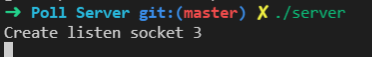
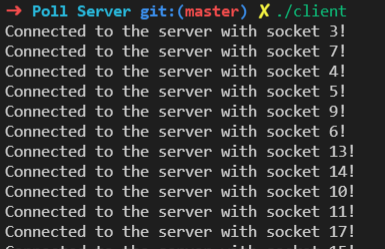
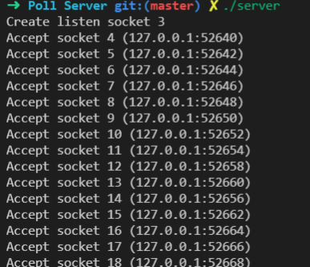
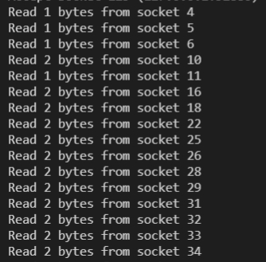
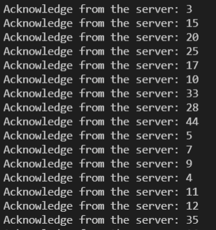
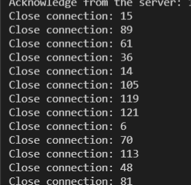
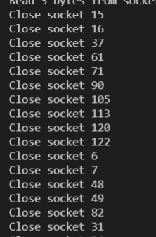
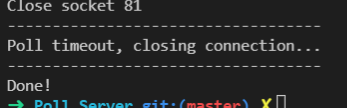

# TCP Server using poll()

## I/O Multiplexing

- **I/O multiplexing** is the capability of notifying if one or more I/O conditions are ready (i.e., input is ready to read, the descriptor is ready to take more output...).
- I/O multiplexing is provided by *select()* and *poll()* functions.

## Poll() function

- The poll() function allows the process to instruct the kernel to either:
  - Wait for any one of multiple events to occur and to wake up the process when one or more of these events occurs.
  - Or when a specific amount of time has passed.

    ```C
    #include <poll.h>

    int poll (struct pollfd *fdarray, unsigned long nfds, int timeout);
    ```

- Parameteres:
  - *fdarray* points to array of *pollfd* structure.

    ```C
    struct pollfd {
        int     fd;       // descriptor to check
        short   events;   // events of interest on fd
        short   revents;  // events that occurred on fd
    };
    ```

  - *nfds* is the number of elements in fdarray.
  - *timeout*: INFTIM (wait forever), 0 (return immediately), > 0 (wait a specified number of miliseconds).
- Return value from poll():
  - -1 if an error occurs.
  - 0 if no descriptors are ready before the timer expires.
  - Number of ready descriptors.

## Poll Server

- The source code does the following:
  - Allocate array of *pollfd* structures: declares OPEN_MAX elements in client array of poolfd structures.

    ```C
    struct pollfd clients[OPEN_MAX];
    ```

  - Initialize:
    - The first element of the array is the listening socket.
    - Set the event of first element to *POLLRDNORM* to notify when a new connection is ready to accept.
    - Set the desciptor for remaining entries to -1.
    - *maxi* is the largest index of the client array currently in use.

    ```C
    clients[0].fd = listenfd;
    clients[0].events = POLLRDNORM;

    for (i = 1; i < OPEN_MAX; i++) {
        clients[i].fd = -1; // -1 indicates available entry
    }

    maxi = 0;
    ```

  - Check for new connection:
    - Call poll() to wait for either a new connection or data on existing connection.
  
    ```C
    nready = poll(clients, maxi + 1, pool_timeout);
    ```

    - If a new connection is accepted, find the first available entry, then save the descriptor and set the POLLRDNORM event.

    ```C
    for (i = 0; i < OPEN_MAX; i++) {
        if (clients[i].fd < 0) {
            clients[i].fd = connfd;
            break;
        }
    }
    ```

  - Check for data on existing connection:
    - Check if the element in *client* array is a file descriptor and have return event POLLWRNORM or POLLERR.
    - Read the data from corresponding socket and send a response to the client socket.
    - If an error occurs, close the connection and set the *fd* of the element to -1.

    ```C
    close(sockfd);
    clients[i].fd = -1;
    ```

  - Close server socket and exit program if descriptors are ready before the timer expires.

## Demo

- Compile files using makefile:
  
  ```C
  make all
  ```

- Execute 2 executable files in separate terminals:
  
  ```C
  ./server
  ./client
  ```

- Results:
  - Start the server: server listening with socket 3.

  

  - Start the client: 120 threads connect to the server.

  

  - Server accepts and connects with clients:

  

  - After connecting, clients send the message to the server:

  

  - Server echos the received message to the clients:

  

  - After receving message from the server, the clients close connection:
    - Client:

      

    - Server:

      

  - When there is no new connection and data from existing connection, the server close the socket and exit:

  

## Conclusion

- I/O multiplexing has good control in terms of memory usage. It has high performance and low resource consumption.
- I/O multiplexing can manage multiple sockets with only one thread, and the system does not need to create new proccesses or threads (compare to forking server and multi-threaded server).
- However, when only processing a small number of connections, the poll server is not as efficients as the multi-threaded blocking I/O model because the poll server requires 2 system calls for a single connection processing (poll() and for example recvfrom()) while blocking I/O model only blocks the system call recvfrom().
